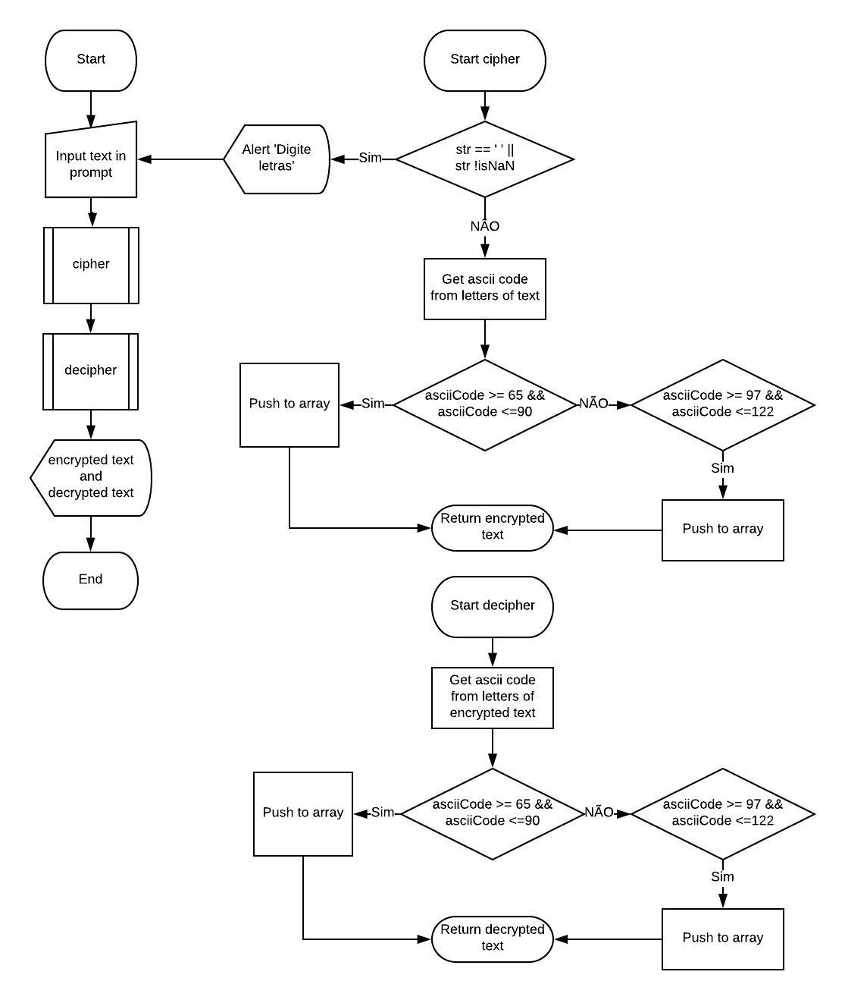

# Cifra de César
De acordo com a Cifra de César, criptografa o texto que é inserido no prompt.

## Descrição
1.  O programa inicia pedindo por meio de um **prompt()** que o usuário digite alguma palavra e os armazena em uma **variável text**.
2.  A função **cipher** inicia, e verifica se o prompt() estiver vazio ou se o que foi inserido são números e retorna um **alert** com a mensagem *'Por favor, digite apenas letras'*, se estiver preenchido irá começar a criptografia do texto.
3.  Por meio de um **for** é feita uma busca para descobrir qual o **código ASCII** de cada letra no texto, os códigos são armazenados em uma **variável asciiCodeC**.
4.  Se os códigos ASCII armazenados forem **iguais ou maiores que 65** e se forem **iguais ou menores que 90**, será feita a criptografia das letras pela fórmula: **(código ASCII - 65 + shift) % 26 + 65** (onde **shift** se refere a quantidade de letras que deseja pular), e armazenados em uma **array encrypted**.
5.  Se os códigos ASCII armazenados forem **iguais ou maiores que 97** e se forem **iguais ou menores que 122**, será feita a criptografia das letras pela fórmula: **(código ASCII - 65 + shift) % 26 + 65** (onde **shift** se refere a quantidade de letras que deseja pular), e armazenados em uma **array encrypted**.
6.  A função **decipher** inicia, usa o texto criptografado para então ser descriptografado.
7.  Por meio de um **for** é feita uma busca para descobrir qual o **código ASCII** de cada letra no texto criptografado, os códigos são armazenados em uma **variável asciiCodeD**.
8.  Se os códigos ASCII armazenados forem **iguais ou maiores que 65** e se forem **iguais ou menores que 90**, será feita a criptografia das letras pela fórmula: **(código ASCII - 65 - shift +52) % 26 + 65** (onde **shift** se refere a quantidade de letras que deseja voltar), e armazenados em uma **array decrypted**.
9.  Se os códigos ASCII armazenados forem **iguais ou maiores que 97** e se forem **iguais ou menores que 122**, será feita a criptografia das letras pela fórmula: **(código ASCII - 65 - shift +52) % 26 + 65** (onde **shift** se refere a quantidade de letras que deseja voltar), e armazenados em uma **array decrypted**.
10. Mostra na tela as mensagens:
- *'Sua mensagem criptografada é + texto criptografado'*
- *'Sua mensagem descriptografada é + texto descriptografado'*

## Fluxograma
